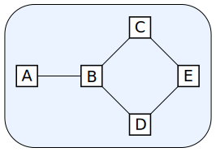

# pangraph [](https://travis-ci.org/tuura/pangraph)  

Pangraph is a Haskell library which offers parsing and serializations for graph files. As well as conversions to other Haskell graph formats. An example format is [GraphML](http://graphml.graphdrawing.org/). A graphml file
could for example represent the following graph, with vertices from `A` to `E` and connections, the edges, between them.  
  
Source:
[Mokhov, et al. (2017)](https://github.com/tuura/papers/tree/3460a889ebcf8e21bbde54f9cb7fc3662a6c7ff8/fdl-2017 "Newcastle University")

## Contents
1. [Usage](#usage)  
2. [Building](#building)
3. [Graph File Support](#graph-file-support)
4. [Library support](#graph-library-support)

## Usage
Pangraph provides an API in the module `Pangraph` for construction and   
manipulation of graphs. The parsers in the library use this module to   
generate pangraphs. Parsers and serializers are imported from modules  
individually. This example shows imports for GraphML.
```haskell
import Pangraph.GraphML.Parser (parse)
import Pangraph.GraphML.Writer (write)
```
Usage of multiple file types in the same module will require  
qualified imports. Please see `src/Pangraph/Examples` for further examples.

## Building
```haskell
stack build
stack test
```

## Graph File Support  

### [GML](https://en.wikipedia.org/wiki/Graph_Modelling_Language)
GML files are currently:
- Parsing: Ok
- Writing: Ok
Node: See `Pangraph.Gml.*`

### [GraphML](http://graphml.graphdrawing.org/)
GraphML files are currently:  
- Parsing: Ok  
- Writing: Ok

### [Workcraft](https://www.workcraft.org/)
Workcraft files are currently:  
- Parsing:  **Unimplemented**  
- Writing:  **Unimplemented**

## Graph Library support  
### [Algebraic Graphs](https://hackage.haskell.org/package/algebraic-graphs)
- Convert:  Via the `ToGraph` interface in `Pangraph`
- Revert:   **Unimplemented**

### [Containers](https://hackage.haskell.org/package/containers)
Currently implements:  
- Convert:  `Pangraph.Containers`
- Revert:   **Unimplemented**

### [FGL](https://hackage.haskell.org/package/fgl)
Currently implements:
- Convert: `Pangraph.FGL`
- Revert: **Unimplemented**
